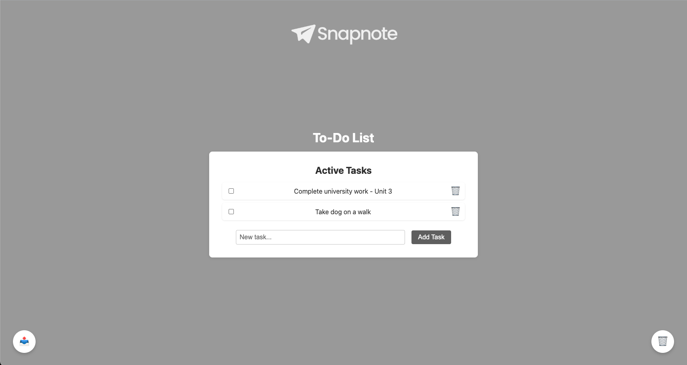

# 📝 Snapnote – Simple To-Do List App

Snapnote is a sleek, lightweight to-do list application built with **React**, **Vite**, and **Supabase**. It features user authentication, task management, soft-deletion with a recycle bin, and a smooth UI experience.

 <!-- Add your own screenshot if desired -->

---

## 🚀 Features

- ✅ User authentication (sign up, log in, log out)
- ✅ Add, edit, and delete tasks
- ✅ Recycle Bin with restore functionality
- ✅ Supabase integration for real-time data storage
- ✅ Clean, responsive UI with confetti 🎉 on task completion

---

## 🛠️ Tech Stack

- [React](https://reactjs.org/)
- [Vite](https://vitejs.dev/)
- [Supabase](https://supabase.com/)
- [Canvas Confetti](https://www.npmjs.com/package/canvas-confetti)

---

## 🧑‍💻 Getting Started

### 1. Clone the Repository

```bash
git clone https://github.com/daim02/snapnote-todo.git
cd snapnote-todo
```

### 2. Install Dependencies
```bash
npm install
```

---

## 🔐 Supabase Setup

1. Go to https://app.supabase.com and create a new project.
2. Go to Table Editor and create a table called todos with these fields:

| Field     | Type    | Description                  |
|-----------|---------|------------------------------|
| id        | UUID    | Primary key, auto-generated  |
| title     | Text    | Task title                   |
| done      | Boolean | Whether the task is done     |
| deleted   | Boolean | Soft-delete flag             |
| user_id   | UUID    | References `auth.users`      |

3. Enable Row Level Security (RLS) on ```todos``` and add this policy:
```bash
CREATE POLICY "Users can manage own todos"
ON todos
FOR ALL
USING (auth.uid() = user_id);
```

4. Go to Settings → API and copy:
- Your Project URL
- Your anon public key

---

## 🔑 Environment Variables

Create a .env file in the root of the project:
```bash
VITE_SUPABASE_URL=https://your-project.supabase.co
VITE_SUPABASE_ANON_KEY=your-anon-key-here
```

## 🧪 Run Locally

```bash
npm run dev
```
